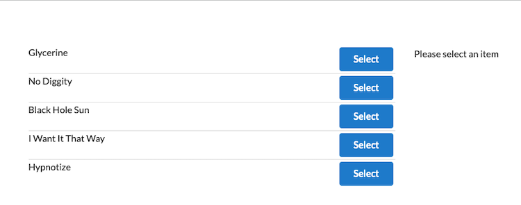
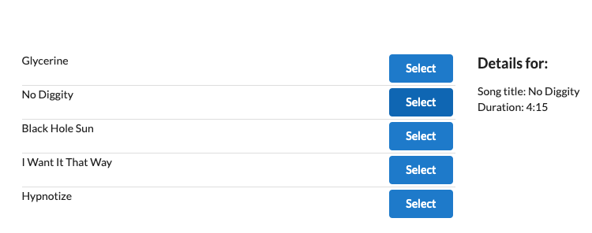

# Items and Details

<em>Items and Details</em> is a React app showing a list of songs and their details.

This app was built to test out React and Redux.

Run the app (see instructions below), then click on the SELECT button next to a song. The song's details will then be shown.





## Built with

- create-react-app

- Redux

- [Semantic UI](httpshttps://semantic-ui.com/)

## Installation and Instructions

#### Step 1 - Install dependencies.

```zsh
$ npm install
```

#### Step 2 - Run app.

```zsh
$ npm start
```
